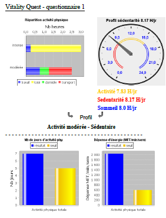
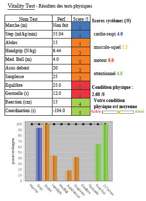

# Contexte
Cette application doit permettre à un participant d'obtenir un livret d'information sur sa condition physique à partir de résultats de tests physiques et de réponses à un (ou plusieurs) questionnaires.

Avant le passage à l'informatisation par une application web, il existait un fichier Excel permettant d'enregistrer les performances de tests et de fournir les résultats sous formes numériques et graphiques. Un animateur faisait passer des tests à un groupe de participants, notait les performances de chacun sur papier et donnait à la fin une liste de performances qu'il fallait recopier sur le fichier Excel.

La saisie du questionnaire se faisait sur papier et les données devaient être recopiées dans un autre formulaire Excel permettant d'obtenir d'autres résultats. Le passage à une série de tests à grande échelle (centaine de participants par jour) rend l'utilisation du fichier Excel très compliquée en terme de temps et de ressources humaines.

La copie des données du questionnaire (environ 300 informations à saisir) est encore plus fastidieuse. Le passage par une application doit alors surtout répondre à un objectif de division des tâches. Ainsi, un participant doit pouvoir remplir son questionnaire en ligne afin d'intégrer directement les données en base.

Afin de répondre au cas où une dizaine d'animateurs puissent saisir des performances en même temps, il a été décidé de les munir d'une tablette pouvant correspondre avec un serveur. Ainsi une centaine de participants pourraient être pris en charge en même temps pour passer des tests.

# Résultat
Les résultats des questionnaires s'affichent en cliquant sur un bouton, ils sont générés avec la dernière version du questionnaire enregistré.
Ils sont composés de données numériques et de graphiques.

Les résultats des questionnaires s'affichent en cliquant sur un des tests de la liste des tests effectués. Les performances sont affichées numériquement ainsi que les scores sur 5 et les pourcentages par rapport à une norme. 

Un graphique des résultats en pourcentages est généré dynamiquement. Il peut être exporté au format image.

# Descriptif des ressources

1 machine (gabarit m1.medium) 

 + 2 CPU (XEON E5-2630 2.4GHz)
 + RAM:4GB
 + Disque dur de 40 GB
