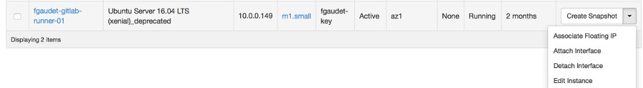
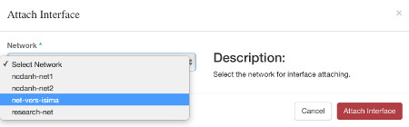
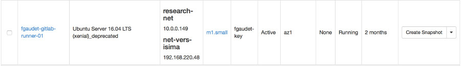

Une nouvelle fonctionnalité a vu le jour sur la plateforme Galactica. Vous avez désormais la possibilité de joindre vos VM depuis le réseau (prof) de l'ISIMA.

Comment faire ? C'est facile, il suffit d'attacher une nouvelle interface à votre VM depuis le menu contextuel des instances (flèche à droite) :

Choisissez le réseau net-vers-isima

Et voilà, vous avez une nouvelle interface sur laquelle vous pouvez faire un SSH.

Accès à la [Documentation](https://galactica.isima.fr/doc/index.html "Documentation Galactica")